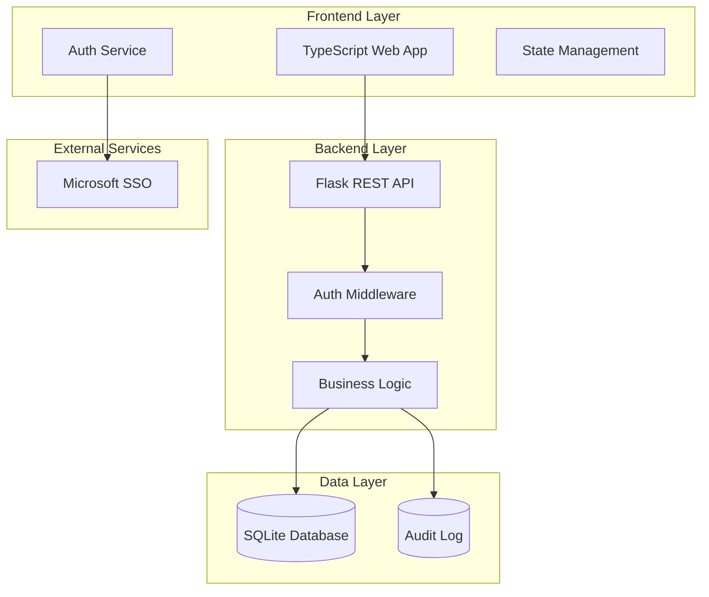

# Design Document

## Overview

SoftBankCashWire is designed as a modern web application with a TypeScript frontend and Python Flask backend, using SQLite for data persistence. The architecture follows a layered approach with clear separation of concerns, implementing secure financial transaction processing with comprehensive audit trails and role-based access control.

## Architecture

### High-Level Architecture



### Technology Stack

- **Frontend**: TypeScript, React, Vite, TailwindCSS
- **Backend**: Python 3.11+, Flask, SQLAlchemy, Flask-JWT-Extended
- **Database**: SQLite with WAL mode for concurrent access
- **Authentication**: Microsoft Graph API for SSO
- **Testing**: Jest (frontend), pytest (backend)
- **Security**: bcrypt, cryptography library for AES-256

## Components and Interfaces

### Frontend Components

#### Core Components
- **App Component**: Main application shell with routing
- **Dashboard**: Account overview and quick actions
- **TransactionList**: Paginated transaction history with search/filter
- **SendMoney**: Money transfer form with recipient selection
- **RequestMoney**: Money request creation and management
- **EventManager**: Event account creation and contribution interface
- **UserProfile**: Account settings and personal information
- **AdminPanel**: User management and system configuration (admin only)
- **Reports**: Financial reporting interface (finance team only)

#### Shared Components
- **AuthGuard**: Route protection based on user roles
- **NotificationCenter**: Real-time notification display
- **LoadingSpinner**: Consistent loading states
- **ErrorBoundary**: Error handling and user feedback
- **Modal**: Reusable modal dialogs
- **FormValidation**: Input validation utilities

### Backend Services

#### Authentication Service
```python
class AuthService:
    def authenticate_microsoft_sso(token: str) -> User
    def validate_session(session_token: str) -> bool
    def get_user_permissions(user_id: str) -> List[Permission]
    def logout_user(session_token: str) -> bool
```

#### Account Service
```python
class AccountService:
    def get_account_balance(user_id: str) -> Decimal
    def validate_transaction_limits(user_id: str, amount: Decimal) -> bool
    def get_transaction_history(user_id: str, filters: dict) -> List[Transaction]
    def update_account_balance(user_id: str, amount: Decimal) -> bool
```

#### Transaction Service
```python
class TransactionService:
    def send_money(sender_id: str, recipient_id: str, amount: Decimal, note: str) -> Transaction
    def request_money(requester_id: str, recipient_id: str, amount: Decimal, note: str) -> MoneyRequest
    def process_money_request(request_id: str, approved: bool) -> bool
    def validate_transaction(sender_id: str, amount: Decimal) -> bool
```

#### Event Service
```python
class EventService:
    def create_event_account(creator_id: str, event_data: dict) -> EventAccount
    def contribute_to_event(user_id: str, event_id: str, amount: Decimal) -> bool
    def close_event_account(event_id: str, closer_id: str) -> bool
    def get_event_contributions(event_id: str) -> List[Contribution]
```

#### Audit Service
```python
class AuditService:
    def log_transaction(transaction: Transaction) -> None
    def log_user_action(user_id: str, action: str, details: dict) -> None
    def log_system_event(event_type: str, details: dict) -> None
    def generate_audit_report(start_date: date, end_date: date) -> AuditReport
```

## Data Models

### Core Entities

#### User Model
```python
class User:
    id: str (UUID)
    microsoft_id: str (unique)
    email: str
    name: str
    role: UserRole (EMPLOYEE, ADMIN, FINANCE)
    account_status: AccountStatus (ACTIVE, SUSPENDED, CLOSED)
    created_at: datetime
    last_login: datetime
```

#### Account Model
```python
class Account:
    id: str (UUID)
    user_id: str (FK to User)
    balance: Decimal (precision=10, scale=2)
    currency: str (default='GBP')
    created_at: datetime
    updated_at: datetime
```

#### Transaction Model
```python
class Transaction:
    id: str (UUID)
    sender_id: str (FK to User)
    recipient_id: str (FK to User)
    amount: Decimal (precision=10, scale=2)
    transaction_type: TransactionType (TRANSFER, EVENT_CONTRIBUTION)
    category: str (optional)
    note: str (optional)
    status: TransactionStatus (COMPLETED, FAILED)
    created_at: datetime
    processed_at: datetime
```

#### EventAccount Model
```python
class EventAccount:
    id: str (UUID)
    creator_id: str (FK to User)
    name: str
    description: str
    target_amount: Decimal (optional)
    deadline: datetime (optional)
    status: EventStatus (ACTIVE, CLOSED, CANCELLED)
    total_contributions: Decimal (computed)
    created_at: datetime
    closed_at: datetime (optional)
```

#### MoneyRequest Model
```python
class MoneyRequest:
    id: str (UUID)
    requester_id: str (FK to User)
    recipient_id: str (FK to User)
    amount: Decimal (precision=10, scale=2)
    note: str (optional)
    status: RequestStatus (PENDING, APPROVED, DECLINED, EXPIRED)
    created_at: datetime
    responded_at: datetime (optional)
    expires_at: datetime
```

#### AuditLog Model
```python
class AuditLog:
    id: str (UUID)
    user_id: str (FK to User, optional)
    action_type: str
    entity_type: str
    entity_id: str
    old_values: JSON (optional)
    new_values: JSON (optional)
    ip_address: str
    user_agent: str
    created_at: datetime
```

### Database Schema Design

#### Indexes
- `idx_user_microsoft_id` on User.microsoft_id
- `idx_transaction_sender_created` on Transaction(sender_id, created_at)
- `idx_transaction_recipient_created` on Transaction(recipient_id, created_at)
- `idx_event_status_created` on EventAccount(status, created_at)
- `idx_audit_user_created` on AuditLog(user_id, created_at)
- `idx_money_request_recipient_status` on MoneyRequest(recipient_id, status)

#### Constraints
- Account.balance CHECK constraint for min/max limits (-250.00 to 250.00)
- Transaction.amount CHECK constraint (> 0)
- EventAccount.target_amount CHECK constraint (> 0 when not null)
- Unique constraint on User.microsoft_id

## Error Handling

### Frontend Error Handling
- **Network Errors**: Retry mechanism with exponential backoff
- **Validation Errors**: Real-time form validation with user-friendly messages
- **Authentication Errors**: Automatic redirect to login with session restoration
- **Permission Errors**: Clear messaging and appropriate UI hiding
- **Transaction Errors**: Detailed error messages with suggested actions

### Backend Error Handling
- **Custom Exception Classes**: Specific exceptions for business logic violations
- **Global Error Handler**: Consistent error response format
- **Transaction Rollback**: Automatic rollback on transaction failures
- **Audit Logging**: All errors logged with context for debugging
- **Rate Limiting**: Protection against abuse with clear error messages

### Error Response Format
```json
{
    "error": {
        "code": "INSUFFICIENT_FUNDS",
        "message": "Transaction cannot be completed due to insufficient funds",
        "details": {
            "current_balance": "150.00",
            "required_amount": "200.00",
            "available_overdraft": "100.00"
        }
    }
}
```

## Testing Strategy

### Frontend Testing
- **Unit Tests**: Component testing with React Testing Library
- **Integration Tests**: API integration testing with MSW (Mock Service Worker)
- **E2E Tests**: Critical user flows with Playwright
- **Accessibility Tests**: Automated a11y testing with axe-core
- **Visual Regression**: Screenshot testing for UI consistency

### Backend Testing
- **Unit Tests**: Service layer testing with pytest and mocking
- **Integration Tests**: Database integration with test SQLite instances
- **API Tests**: Full API endpoint testing with test client
- **Security Tests**: Authentication and authorization testing
- **Performance Tests**: Load testing for concurrent transaction processing

### Test Data Management
- **Fixtures**: Reusable test data for consistent testing
- **Database Seeding**: Automated test data generation
- **Test Isolation**: Each test runs with clean database state
- **Mock External Services**: Microsoft SSO mocking for testing

### Testing Coverage Requirements
- **Backend**: Minimum 90% code coverage
- **Frontend**: Minimum 80% code coverage
- **Critical Paths**: 100% coverage for transaction processing
- **Security Features**: 100% coverage for authentication and authorization

## Security Implementation

### Authentication Security
- **JWT Tokens**: Short-lived access tokens with refresh token rotation
- **Session Management**: Secure session storage with httpOnly cookies
- **CSRF Protection**: CSRF tokens for state-changing operations
- **Rate Limiting**: Login attempt limiting and API rate limiting

### Data Security
- **Encryption at Rest**: SQLite database encryption using SQLCipher
- **Encryption in Transit**: TLS 1.3 for all API communications
- **Sensitive Data Handling**: No sensitive data in logs or client-side storage
- **Input Validation**: Comprehensive server-side validation for all inputs

### Financial Security
- **Transaction Atomicity**: ACID compliance for all financial operations
- **Double-Entry Validation**: Balance verification before and after transactions
- **Audit Trail Integrity**: Immutable audit logs with cryptographic hashing
- **Fraud Detection**: Pattern analysis for unusual transaction behavior

### Access Control
- **Role-Based Permissions**: Granular permission system
- **Resource-Level Authorization**: User can only access their own data
- **Admin Segregation**: Separate admin interface with enhanced security
- **API Security**: OAuth 2.0 for API access with scope-based permissions